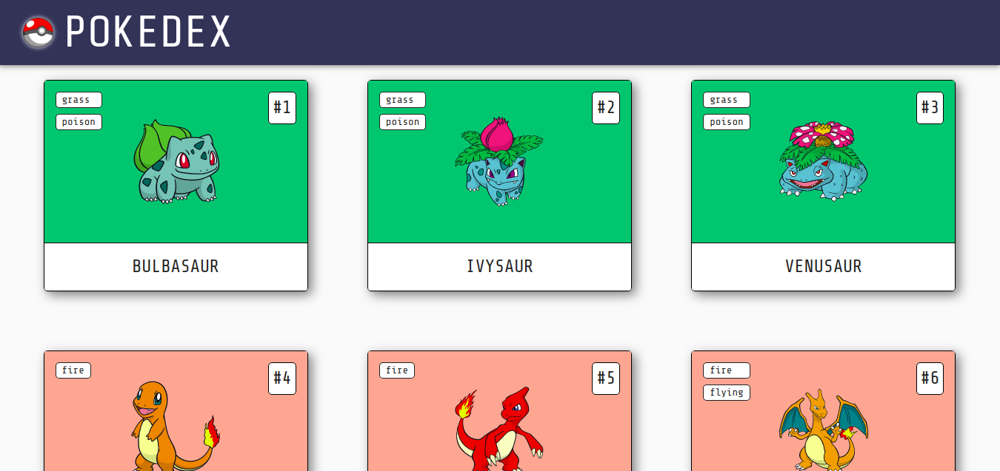
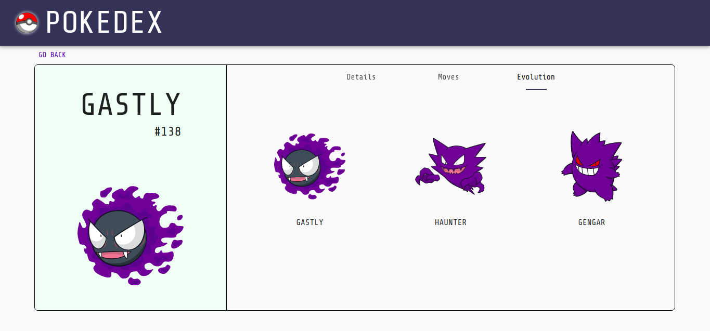
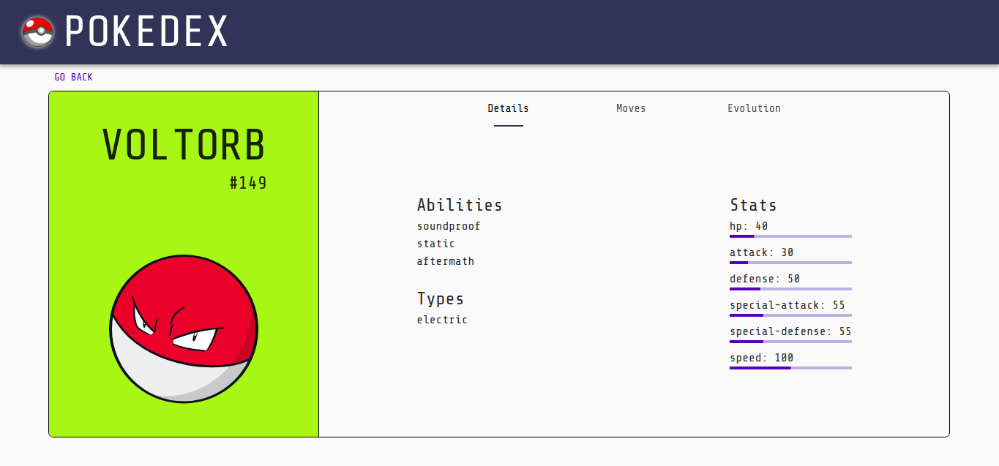
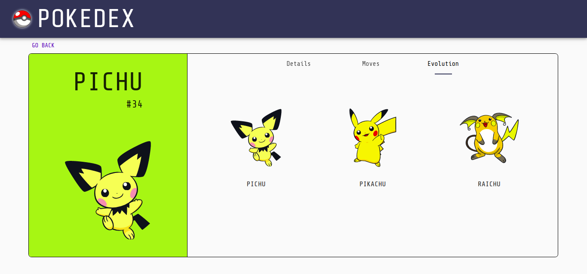

# Pokedex

Application to list Pokemons and its detail information.

Visit [Pokedex](https://pokedex-beta-six.vercel.app/#/) deployed at Vercel.

 
 

 

## Instructions

1. Clone or download the repository

`git clone git@github.com:Balazs-D/pokedex.git`

2. Get into directory

`cd pokedex`

3. Install dependencies

`npm install`

4. Run te application

`npm start`

## Technologies

- React.js
- TypeScript
- Material UI

## Test

Testing is actually not working correctly.

`npm test`
